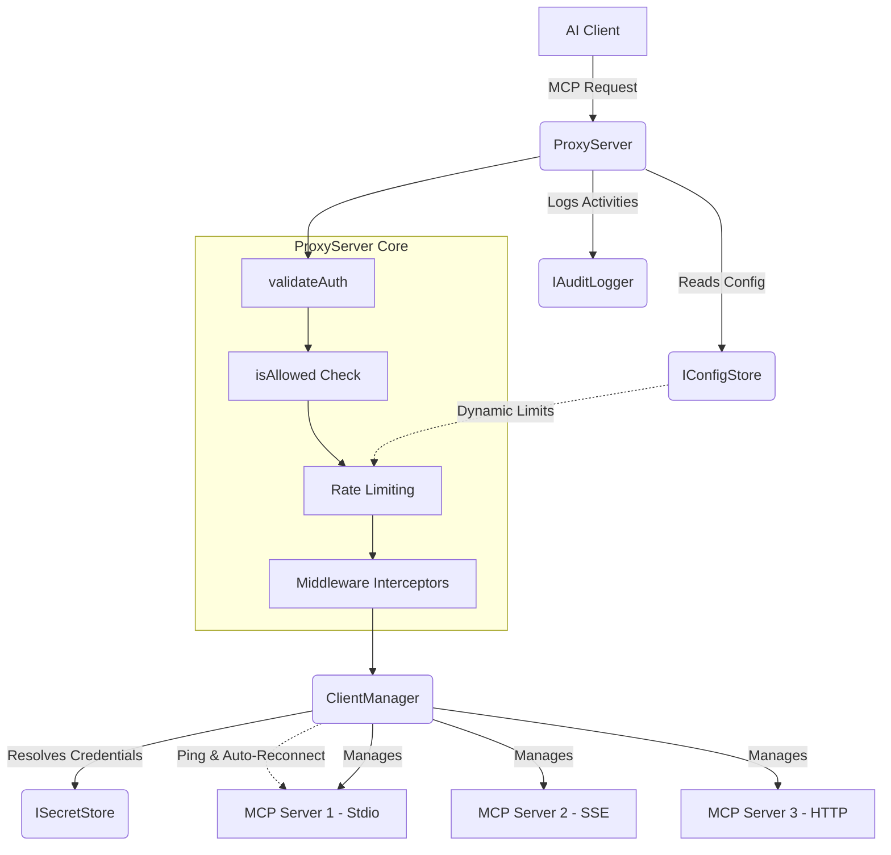
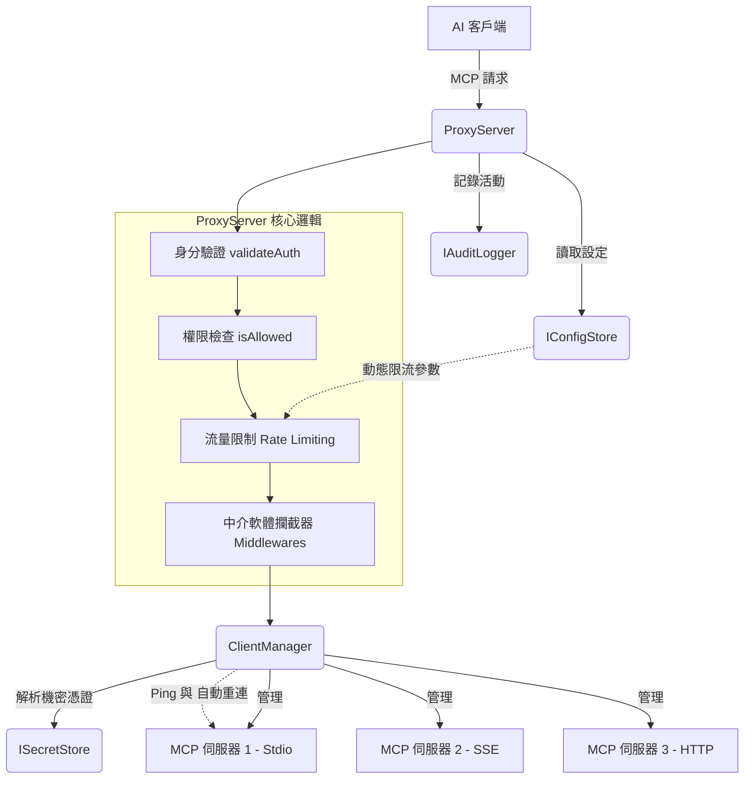

# AAG-Core Architecture

**[English](#english)** | **[中文](#chinese)**

---

## English

This document provides a high-level overview of the architectural design of `@cyber-sec.space/aag-core`.

### Design Philosophy

The core package is designed with **Inversion of Control (IoC)** and **Dependency Injection** in mind. By keeping the core agnostic to the environment (CLI, Background Daemon, Cloud Service), we allow it to be seamlessly integrated into both open-source local setups and commercial cloud-based deployments. 

The core solely concerns itself with MCP routing, connection management, and authorization, delegating storage and logging to external implementations.

### Core Components

#### 1. Interfaces
To integrate `aag-core`, the host application must provide implementations for:
- **`IConfigStore`**: Manages the proxy configuration (AI keys, tool permissions, registered MCP servers). It supports event listeners to reload configurations on the fly.
- **`ISecretStore`**: Securely resolves secrets from URIs. For example, a CLI wrapper might resolve `keytar://my-secret` using OS-level secure enclaves.
- **`IAuditLogger`**: Centralized logging interface.

#### 2. `ClientManager`
The `ClientManager` is responsible for observing the configuration and maintaining active network or stdio connections to downstream MCP servers. 
- Automatically syncs client lifecycles when configurations change.
- Injects resolved secrets into downstream transports dynamically (via environment variables, HTTP headers, or streaming endpoints).
- Maintains an internal Ping Daemon to ensure downstream transports are responsive, initiating exponential backoff reconnection procedures immediately upon timeouts.

#### 3. `ProxyServer`
The `ProxyServer` leverages the official `@modelcontextprotocol/sdk` to expose an upstream server interface. It intercepts major MCP routines:
- **`ListTools`**: Gathers tools from all connected downstream servers, applies namespace prefixes to prevent collisions, filters them against the authenticated AI client's permission rules, and returns the unified list.
- **`CallTool`**: Parses the prefixed tool name, authenticates the request, ensures the AI client holds the proper whitelist/blacklist permissions, resolves necessary payload credentials, and proxies the execution to the correct downstream `ClientManager` connection.
- **`Middlewares`**: Supports an extensible `ProxyMiddleware` pipeline with `onRequest` and `onResponse` hooks, allowing interception and mutation of tool arguments and masking of output contents (e.g., stripping Secrets or API keys before returning to the AI).

---

## 中文

本文檔提供了 `@cyber-sec.space/aag-core` 架構設計的高階總覽。

### 設計理念

核心層的設計融入了 **控制反轉 (Inversion of Control, IoC)** 與 **依賴注入 (Dependency Injection)** 的理念。將核心邏輯與執行環境（CLI、背景守護行程、雲端服務）解耦，使其能夠無縫整合到開源本地端環境或商業雲端部署中。

核心引擎專注於 MCP 的路由、連線管理與授權，並將儲存與日誌記錄工作委派給外部實作。

### 核心元件

#### 1. 介面 (Interfaces)
為了整合 `aag-core`，宿主應用程式 (Host Application) 必須提供以下介面的實作：
- **`IConfigStore`**: 管理代理設定 (包含 AI 金鑰、工具權限、已註冊的 MCP 伺服器)。支援事件監聽器，可在設定檔變更時即時重新載入。
- **`ISecretStore`**: 安全地從 URI 解析機密資訊。例如，CLI 包裝器可以透過作業系統層級的安全儲存區 (Secure Enclave) 來解析 `keytar://my-secret`。
- **`IAuditLogger`**: 統一的日誌記錄介面。

#### 2. `ClientManager` (客戶端管理器)
`ClientManager` 負責監聽設定檔，並維護與下游 MCP 伺服器的主動網路或 stdio 連線。
- 當設定更改時，自動同步客戶端的生命週期。
- 動態地將解析後的機密資訊注入至下游傳輸層（透過環境變數、HTTP Headers，或是串流端點）。
- 透過內建的 Ping Daemon 背景常駐任務來確保下游傳輸層的回應能力，一旦發生超時，會立即觸發指數退避 (Exponential Backoff) 自動重連程序。

#### 3. `ProxyServer` (代理伺服器)
`ProxyServer` 運用官方的 `@modelcontextprotocol/sdk` 暴露了一個上游的伺服器介面。它主要攔截並處理核心的 MCP 請求：
- **`ListTools`**: 從所有已連線的下游伺服器收集工具，應用命名空間前綴以避免名稱衝突，接著根據已驗證 AI 客戶端的權限規則進行過濾，並回傳統一的工具清單。
- **`CallTool`**: 解析帶有前綴的工具名稱，驗證請求，確保 AI 客戶端擁有合法的白名單/黑名單權限，解析 Payload 內必需的機密資訊，最後將執行請求代理至正確的下游 `ClientManager` 連線。
- **`中介軟體 (Middlewares)`**: 支援可擴充的 `ProxyMiddleware` 管線，提供 `onRequest` 與 `onResponse` 鉤子 (Hooks)，允許在發送前修改引數、並在回傳給 AI 前攔截與遮蔽輸出內容 (如移除機密個資或 API Keys)。
