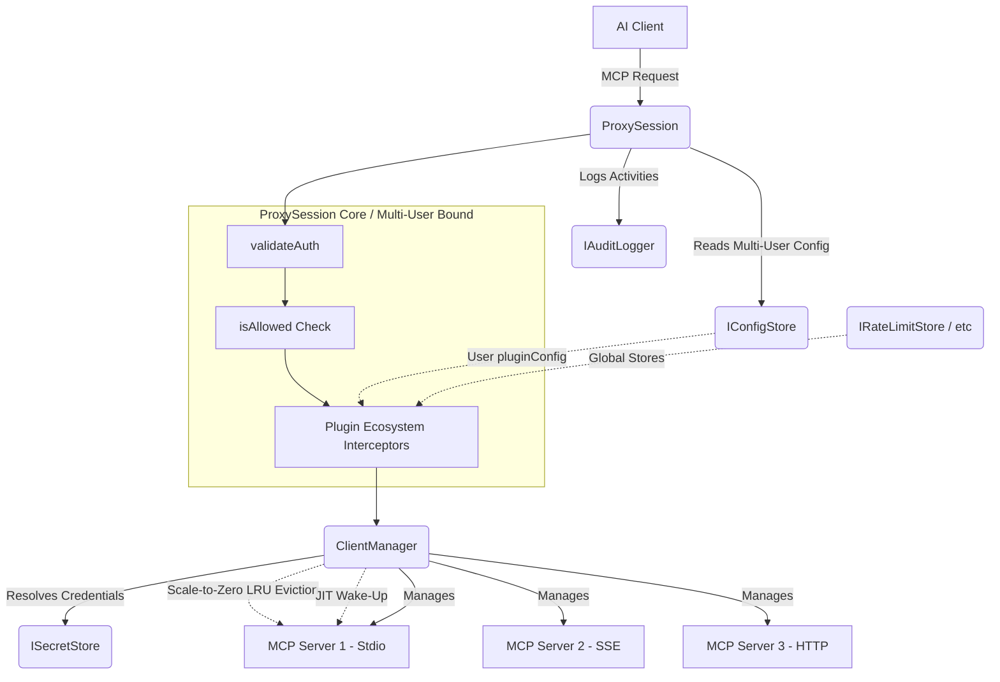
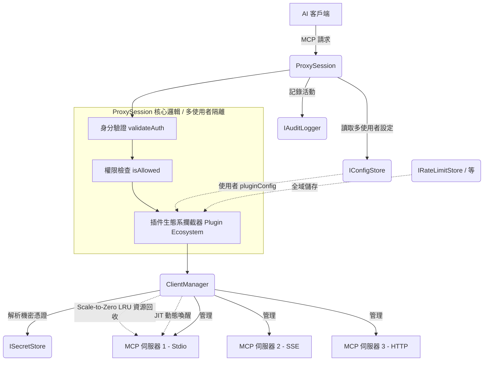

# AAG-Core Architecture

**[English](#english)** | **[中文](#chinese)**

---

## English

This document provides a high-level overview of the architectural design of `@cyber-sec.space/aag-core`.

### Design Philosophy

The core package is designed with **Inversion of Control (IoC)** and **Dependency Injection** in mind. By keeping the core agnostic to the environment, we allow it to be seamlessly integrated into various deployments. 

The core solely concerns itself with MCP routing, connection management, and authorization, delegating storage and logging to external implementations.

### Core Components

#### 1. Interfaces
To integrate `aag-core`, the host application must provide implementations for:
- **`IConfigStore`**: Manages the proxy configuration (AI keys, tool permissions, registered MCP servers). It supports event listeners to reload configurations on the fly.
- **`ISecretStore`**: Securely resolves secrets from URIs. For example, a CLI wrapper might resolve `keytar://my-secret` using OS-level secure enclaves.
- **`IAuditLogger`**: Centralized logging interface.
- **`IRateLimitStore`**: Distributed atomic request mapper for rate buckets, required by components like `RateLimitMiddleware` to accurately map synchronized API limits across horizontal scaling (e.g. inject Redis scripts).

#### 2. `ClientManager`
The scale-to-zero `ClientManager` is responsible for observing the configuration and lazily managing downstream MCP connections.
- Automatically syncs client lifecycles when configurations change.
- Native **JIT (Just-In-Time) connectability** spawns MCP downstreams only when actively invoked, saving immense memory footprints.
- Idle active TCP/stdio connections eventually fall to `DISCONNECTED_IDLE` leveraging background **LRU ping sweeping** after long durations of inactivity.

#### 3. `ProxyServer` (as a `ProxySession`)
The `ProxyServer` leverages the official `@modelcontextprotocol/sdk` to expose an upstream server interface. It intercepts major MCP routines under a stateless identity schema:
- **Multi-User Configuration**: Injecting `ProxySessionOptions` removes the reliance on `process.env`. `aag-core` easily boots thousands of concurrent, independently authenticated sessions running across isolated users globally.
- **`ListTools`**: Gathers tools from all connected downstream servers dynamically waking them, applies namespace prefixes to prevent collisions, filters them against the authenticated AI client's permission rules, and returns the unified list.
- **`CallTool`**: Parses the prefixed tool name, authenticates the request, ensures the AI client holds the proper whitelist/blacklist permissions, resolves necessary payload credentials, and proxies the execution to the newly awakened downstream connection.
- **`Plugin Ecosystem`**: Standardized `IPlugin` interfaces loaded dynamically via `PluginLoader`. Community extensions (e.g. `RateLimitPlugin`, `DataMaskingPlugin`) register powerful `ProxyMiddleware` pipelines combining native multi-user `pluginConfig` isolation with global `options`.

#### 4. Security & Multi-Tenant Constraints
- **Cross-Tenant State Pollution**: `aag-core` multiplexes tool calls from different users routing to the same downstream MCP server ID through a shared background process to conserve resources. Therefore, **Downstream MCP Servers must be strictly stateless**. If a downstream server maintains state (e.g., chat history, databases) without explicitly verifying the `aiId` inside the tool arguments, Tenant A could potentially access Tenant B's data. If stateful downstream servers are required, SaaS providers must deploy isolated server instances per tenant in the `IConfigStore`.
- **SSRF via `IConfigStore`**: The `ClientManager` connects to any `url` provided by the Host's configuration. Host applications must strictly sanitize and validate URLs returned by `IConfigStore` to prevent Server-Side Request Forgery (SSRF) attacks against internal VPC networks (e.g., `169.254.169.254`).
- **Strict Zod Validation**: All Host JSON configurations injected into `syncConfig()` undergo rigorous parsing via `ProxyConfigSchema.parse()`. This guarantees structural integrity and prevents malformed parameters from crashing the multiplexers.
- **Typed Error Ecosystem**: System exceptions explicitly throw structured `AagError` subclasses (`AuthenticationError`, `UpstreamConnectionError`, `AagConfigurationError`). Host applications can easily `catch` these to reliably determine the precise HTTP response statusCode.

---

## 中文

本文檔提供了 `@cyber-sec.space/aag-core` 架構設計的高階總覽。

### 設計理念

核心層的設計融入了 **控制反轉 (Inversion of Control, IoC)** 與 **依賴注入 (Dependency Injection)** 的理念。將核心邏輯與執行環境（CLI、背景守護行程、雲端服務）解耦，使其能夠無縫整合到開源本地端環境或商業雲端部署中。

核心引擎專注於 MCP 的路由、連線管理與授權，並將儲存與日誌記錄工作委派給外部實作。

### 核心元件

#### 1. 介面 (Interfaces)
為了整合 `aag-core`，宿主應用程式 (Host Application) 必須提供以下介面的實作：
- **`IConfigStore`**: 管理代理設定 (包含 AI 金鑰、工具權限、已註冊的 MCP 伺服器)。
- **`ISecretStore`**: 安全地從 URI 解析機密資訊。例如使用 `keytar://my-secret` 系統級加密。
- **`IAuditLogger`**: 統一的日誌記錄介面。
- **`IRateLimitStore`**: 分散式限流儲存區。為 V2 叢集擴展部署的核心，允許 `RateLimitMiddleware` 中介服務使用 Redis 的原子性實作同步多台 Pod 機器的限流次數。

#### 2. `ClientManager` (客戶端管理器 - Scale-to-Zero)
V2 的 `ClientManager` 被升級為無狀態資源調度池，動態按需切換 MCP 狀態。
- 當設定更改時，自動同步客戶端的生命週期。
- 新增 **JIT (Just-In-Time) 動態喚醒**：當 AI 發出實際請求時才進行 Downstream 連線，大幅壓縮數千個空閒用戶的記憶體消耗。
- 新增 **LRU 斷絕回收**：將過期與閒置的程序背景清空至 `DISCONNECTED_IDLE` 狀態，達成完美的 Scale-to-Zero 綠能架構。

#### 3. `ProxyServer` (升級為 `ProxySession`)
`ProxyServer` 主要攔截並處理核心的 MCP 請求，同時摒除任何全域綁定與狀態洩漏：
- **動態身分切換**: 可透過 `ProxySessionOptions` 給定每個建構實例純粹的 `aiId`，拋棄 `process.env` 高耦合做法。實現在單一 Node.js 程序中建立成千上萬個安全的獨立 `aag-core` 客戶連線。
- **`ListTools`**: 收集工具，應用命名空間前綴避免名稱衝突，並根據白名單規則進行過濾回傳。此期間亦可使用 JIT 動態喚醒下游服務。
- **`CallTool`**: 解析與驗證權限，解析 Payload 內必需的機密資訊，最後代理至 JIT 客戶端。
- **`全域插件生態系 (Plugin Ecosystem)`**: 內建標準化 `IPlugin` 介面與 `PluginLoader`。支援動態外部擴充套件註冊，社群開發者能輕易發布原生支援多使用者隔離 (`pluginConfig`) 參數架構的插件（如預設提供的 `RateLimitPlugin` 與 `DataMaskingPlugin`）。

#### 4. 資安與多租戶隔離限制 (Security Constraints)
- **跨租戶狀態污染 (Cross-Tenant State Pollution)**: 為了追求最高效能，`aag-core` 會將指向同一個 MCP 伺服器 ID 的多名使用者請求，多工對接至**同一個下游背景程序**。因此，**下游的 MCP 伺服器必須是絕對無狀態的 (Strictly Stateless)**。如果下游伺服器具有狀態（例如共用 SQLite 或記憶體快取），租戶 A 可能會存取到租戶 B 的資料。如果必須使用有狀態工具，SaaS 營運商應在 `IConfigStore` 中為不同租戶配置獨立的 MCP 伺服器實例。
- **伺服器端請求偽造 (SSRF)**: `ClientManager` 會無條件連線至 `IConfigStore` 所提供的 `url`。宿主應用程式 (Host Application) 寫入配置前，必須嚴格驗證 URL 格式並實作內部內網 IP 黑名單，以防止攻擊者透過 SSRF 探測內部 VPC 網路（如 AWS `169.254.169.254`）。
- **嚴格的 Zod 型別驗證 (Zod Schema Validation)**: 所有透過 `syncConfig()` 注入的 Host 設定檔，皆必須通過 `ProxyConfigSchema` 的嚴苛檢驗。這確保了結構的絕對完整性，拒絕任何格式錯誤的設定進入代理管線。
- **全端型別錯誤生態系 (Typed Error Ecosystem)**: 系統內部徹底揚棄了廣泛的字串錯誤，全面擲出具有語義的 `AagError` 子類（例如 `AuthenticationError`、`UpstreamConnectionError`、`RateLimitExceededError`）。這使得 Host 應用程式在呼叫時，可以直接透過捕捉這類例外來給予前端精確的 HTTP Response 狀態碼。
