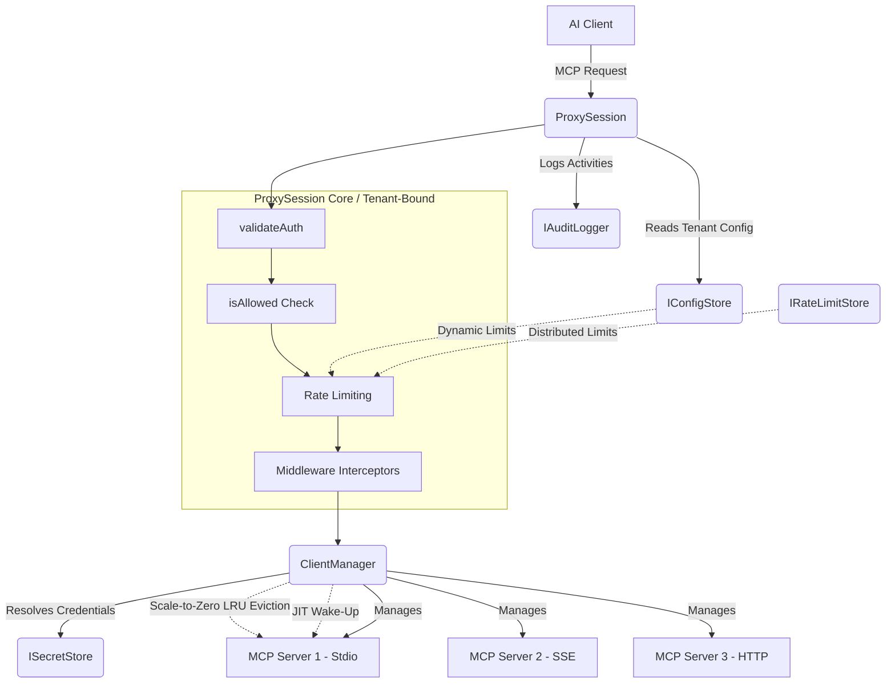
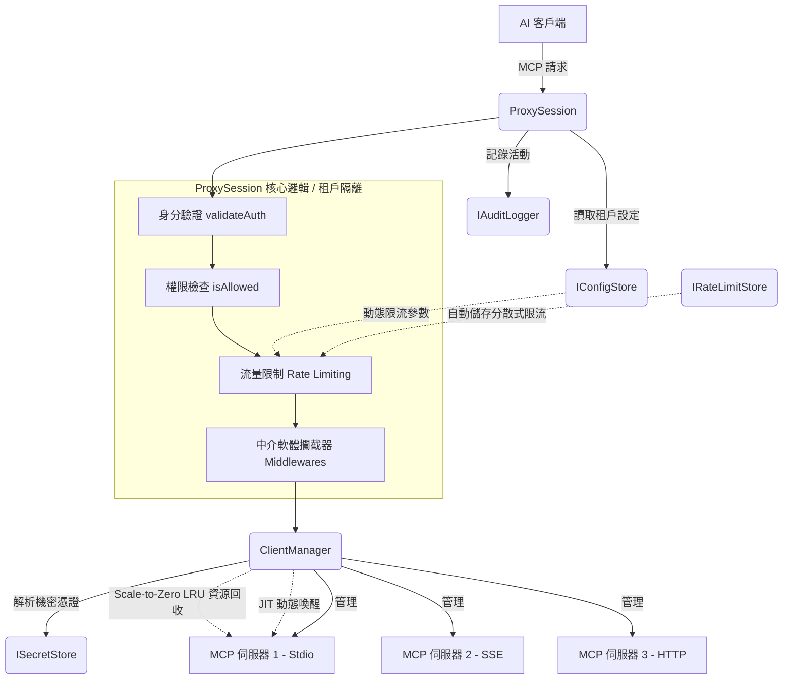

# AAG-Core Architecture

**[English](#english)** | **[中文](#chinese)**

---

## English

This document provides a high-level overview of the architectural design of `@cyber-sec.space/aag-core`.

### Design Philosophy

The core package is designed with **Inversion of Control (IoC)** and **Dependency Injection** in mind. By keeping the core agnostic to the environment (CLI, Background Daemon, Cloud Service), we allow it to be seamlessly integrated into both open-source local setups and commercial cloud-based deployments. 

The core solely concerns itself with MCP routing, connection management, and authorization, delegating storage and logging to external implementations.

### Core Components

#### 1. Interfaces
To integrate `aag-core`, the host application must provide implementations for:
- **`IConfigStore`**: Manages the proxy configuration (AI keys, tool permissions, registered MCP servers). It supports event listeners to reload configurations on the fly.
- **`ISecretStore`**: Securely resolves secrets from URIs. For example, a CLI wrapper might resolve `keytar://my-secret` using OS-level secure enclaves.
- **`IAuditLogger`**: Centralized logging interface.
- **`IRateLimitStore`**: Distributed atomic request mapper for rate buckets, required by components like `RateLimitMiddleware` to accurately map synchronized API limits across horizontal scaling (e.g. inject Redis scripts).

#### 2. `ClientManager`
The scale-to-zero `ClientManager` is responsible for observing the configuration and lazily managing downstream MCP connections.
- Automatically syncs client lifecycles when configurations change.
- Native **JIT (Just-In-Time) connectability** spawns MCP downstreams only when actively invoked, saving immense memory footprints locally and remotely.
- Idle active TCP/stdio connections eventually fall to `DISCONNECTED_IDLE` leveraging background **LRU ping sweeping** after long durations of inactivity.

#### 3. `ProxyServer` (as a `ProxySession`)
The `ProxyServer` leverages the official `@modelcontextprotocol/sdk` to expose an upstream server interface. It intercepts major MCP routines under a stateless identity schema:
- **Tenant-Bound Configuration**: Injecting `ProxySessionOptions` removes the reliance on `process.env`. `aag-core` easily boots thousands of concurrent, independently authenticated sessions running across isolated users globally.
- **`ListTools`**: Gathers tools from all connected downstream servers dynamically waking them, applies namespace prefixes to prevent collisions, filters them against the authenticated AI client's permission rules, and returns the unified list.
- **`CallTool`**: Parses the prefixed tool name, authenticates the request, ensures the AI client holds the proper whitelist/blacklist permissions, resolves necessary payload credentials, and proxies the execution to the newly awakened downstream connection.
- **`Plugin Ecosystem`**: Standardized `IPlugin` interfaces loaded dynamically via `PluginLoader`. Community extensions (e.g. `RateLimitPlugin`, `DataMaskingPlugin`) register powerful `ProxyMiddleware` pipelines combining native SaaS tenant `pluginConfig` isolation with global `options`.

---

## 中文

本文檔提供了 `@cyber-sec.space/aag-core` 架構設計的高階總覽。

### 設計理念

核心層的設計融入了 **控制反轉 (Inversion of Control, IoC)** 與 **依賴注入 (Dependency Injection)** 的理念。將核心邏輯與執行環境（CLI、背景守護行程、雲端服務）解耦，使其能夠無縫整合到開源本地端環境或商業雲端部署中。

核心引擎專注於 MCP 的路由、連線管理與授權，並將儲存與日誌記錄工作委派給外部實作。

### 核心元件

#### 1. 介面 (Interfaces)
為了整合 `aag-core`，宿主應用程式 (Host Application) 必須提供以下介面的實作：
- **`IConfigStore`**: 管理代理設定 (包含 AI 金鑰、工具權限、已註冊的 MCP 伺服器)。
- **`ISecretStore`**: 安全地從 URI 解析機密資訊。例如使用 `keytar://my-secret` 系統級加密。
- **`IAuditLogger`**: 統一的日誌記錄介面。
- **`IRateLimitStore`**: 分散式限流儲存區。為 V2 叢集擴展部署的核心，允許 `RateLimitMiddleware` 中介服務使用 Redis 的原子性實作同步多台 Pod 機器的限流次數。

#### 2. `ClientManager` (客戶端管理器 - Scale-to-Zero)
V2 的 `ClientManager` 被升級為無狀態資源調度池，動態按需切換 MCP 狀態。
- 當設定更改時，自動同步客戶端的生命週期。
- 新增 **JIT (Just-In-Time) 動態喚醒**：當 AI 發出實際請求時才進行 Downstream 連線，大幅壓縮數千個空閒用戶的記憶體消耗。
- 新增 **LRU 斷絕回收**：將過期與閒置的程序背景清空至 `DISCONNECTED_IDLE` 狀態，達成完美的 Scale-to-Zero 綠能架構。

#### 3. `ProxyServer` (升級為 `ProxySession`)
`ProxyServer` 主要攔截並處理核心的 MCP 請求，同時摒除任何全域綁定與狀態洩漏：
- **動態身分切換**: 可透過 `ProxySessionOptions` 給定每個建構實例純粹的 `aiId`，拋棄 `process.env` 高耦合做法。實現在單一 Node.js 程序中建立成千上萬個安全的獨立 `aag-core` 客戶連線。
- **`ListTools`**: 收集工具，應用命名空間前綴避免名稱衝突，並根據白名單規則進行過濾回傳。此期間亦可使用 JIT 動態喚醒下游服務。
- **`CallTool`**: 解析與驗證權限，解析 Payload 內必需的機密資訊，最後代理至 JIT 客戶端。
- **`全域插件生態系 (Plugin Ecosystem)`**: 內建標準化 `IPlugin` 介面與 `PluginLoader`。支援動態外部擴充套件註冊，社群開發者能輕易發布原生支援 SaaS 租戶隔離 (`pluginConfig`) 參數架構的插件（如預設提供的 `RateLimitPlugin` 與 `DataMaskingPlugin`）。
