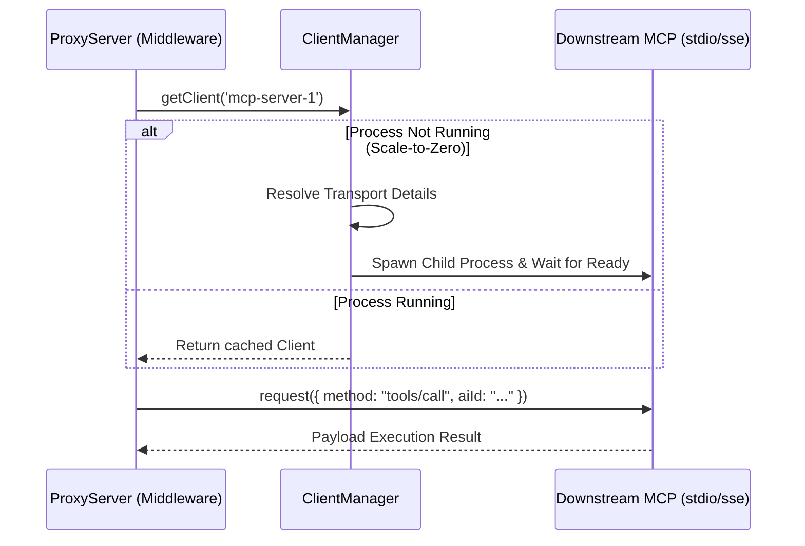
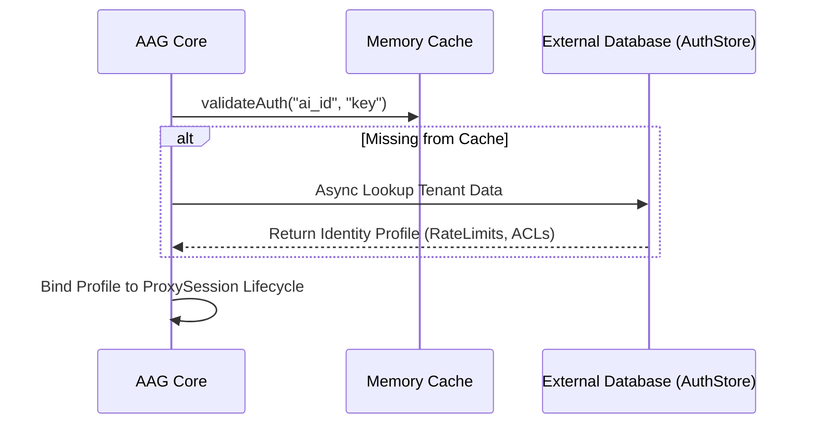
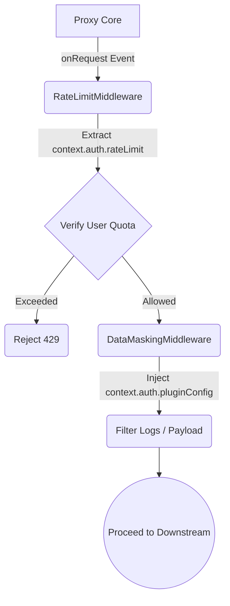
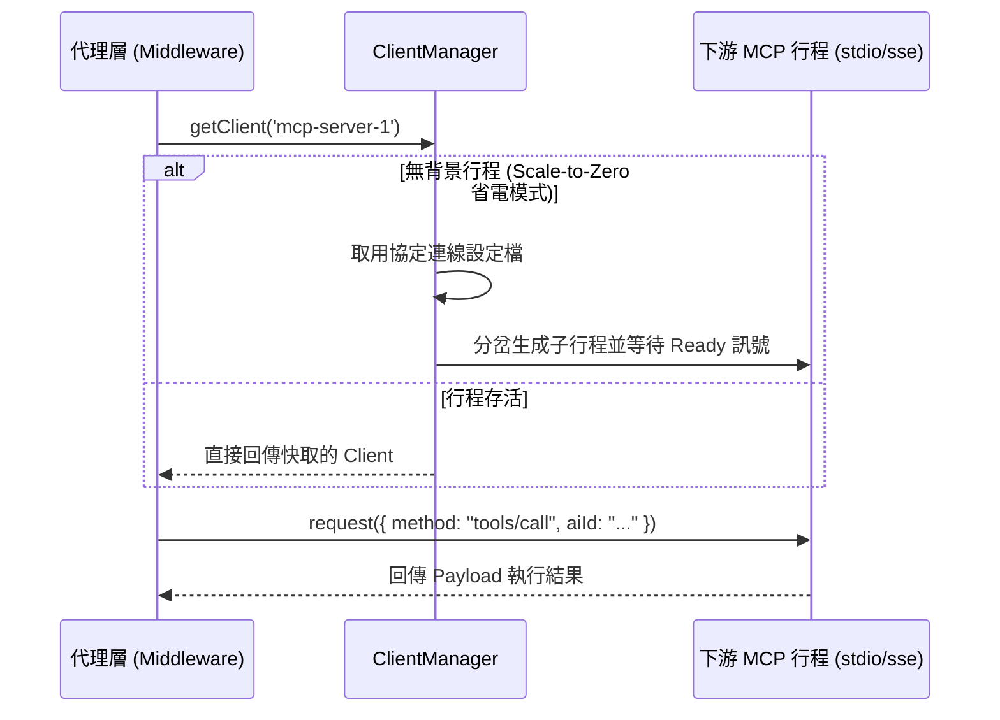
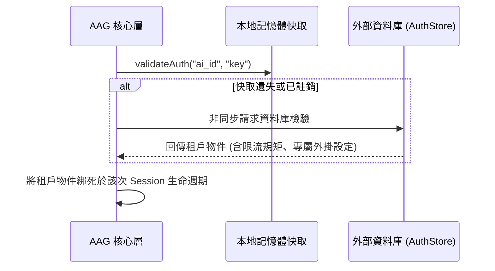
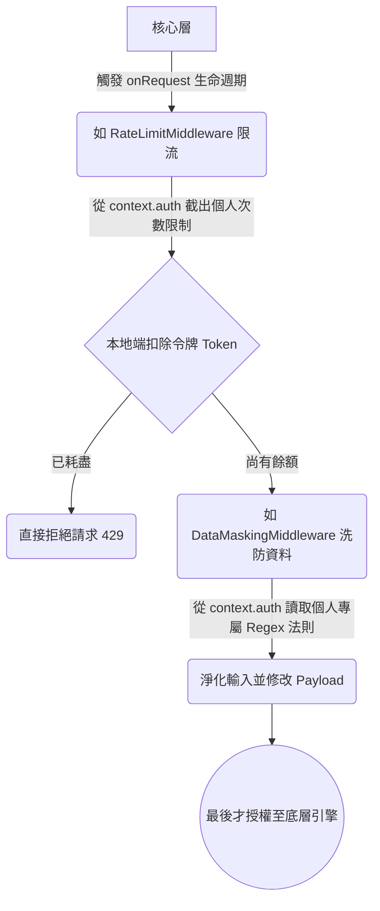

# AAG-Core Architecture

**[English](#english)** | **[中文](#chinese)**

---

<a id="english"></a>
## English

This document provides a highly detailed architectural breakdown of `@cyber-sec.space/aag-core`. By leveraging Inversion of Control (IoC) and Stateless Context Injections, `aag-core` effortlessly scales to handle thousands of concurrent Model Context Protocol (MCP) clients inside zero-trust SaaS environments.

The system is composed of five distinct engines:

---

### 1. `ClientManager` (Scale-to-Zero & Downstream Pooling)

The `ClientManager` is the core dispatch pool that dictates the lifecycles of backend MCP servers. It strictly adheres to "Scale-to-Zero" and "Just-In-Time" methodologies, saving massive resources.

**Key Mechanics:**
- **JIT Wake-Up**: Downstream standard-io (stdio) child processes or continuous Server-Sent Events (SSE) background connections are not created when the core boots. They are only resolved and spawned at the exact millisecond an AI client makes a valid `CallTool` request or `ListTools` lookup.
- **Stateless Multiplexing**: If User A and User B both hold valid credentials to execute tools on `mcp-server-1`, the system routes *both* users through the *exact same* background child process instance, stripping context logic to the bare arguments payload.
- **LRU Ping Daemon**: A background thread continuously pings idle connections. If a connection lives past its idle threshold, it is automatically terminated (`DISCONNECTED_IDLE`) to recoup OS memory.



---

### 2. `ProxyServer` (ProxySession Auth Pipeline)

The `ProxyServer` manages the upstream endpoint handling connecting AI models (such as Claude Desktop or custom agents). It intercepts all standard MCP requests and enforces a strict sequence of authorization algorithms before any downstream resource wakes up.

**Pipeline Flow:**
- **Identity Evaluation**: As incoming streams connect over SSE or Stdio, it decodes headers or payloads, feeding `AI_ID` and `AI_KEY` to the `IAuthStore`.
- **Pre-Flight Context Injection**: Upon success, a `ProxyContext` object is molded containing the resolved `AuthKey` and is passed linearly through the request.
- **RBAC Matrix**: Tools and servers are parsed during `ListTools` and `CallTool`. They are subjected to the multi-node `permissions` block (allow/deny matrices utilizing wildcard matching) ensuring users only see tools they are allowed to execute.

```mermaid
flowchart TD
    Req[Incoming MCP Request] --> Validate{validateAuth()}
    Validate -- Failure --> Err1[throw AuthenticationError]
    Validate -- Success --> Ctx[Inject context.auth]
    
    Ctx --> Middlewares[Run Pre-Flight Plugins]
    Middlewares --> Type{Request Type?}
    
    Type -- ListTools --> RBAC_List(Filter by server/tool permissions)
    RBAC_List --> Mux_List((Multiplex Downstreams))
    
    Type -- CallTool --> RBAC_Call(Check against call privileges)
    RBAC_Call -- Unauthorized --> Err2[throw AuthorizationError]
    RBAC_Call -- Authorized --> Exec((Forward Base Payload))
```

---

### 3. `IAuthStore` & `IConfigStore` (Identity Data Flow)

To fully support SaaS architectures running globally distributed fleets of AAG instances, identity checking was decoupled into its own native interface structure.

- **`IConfigStore`**: Only holds static routing information (i.e., definitions of active MCP tools, global plugin fallback variables).
- **`IAuthStore`**: Asynchronously resolves boolean validation and structured token buckets (rate limiting quotas, permission structures) for an active user. You are able to implement custom databases here (e.g., querying PostgreSQL or Redis) to enable multi-tenant access.



---

### 4. `SessionManager` (Real-Time Revocation)

Because AI Client connection types like `Server-Sent Events (SSE)` are persistent and can theoretically be attached forever, rotating API keys or suddenly banning a user in an external database would normally take days to propagate if relying *only* on the initial `validateAuth`.

The `SessionManager` exposes a direct interruption mapping:
- Tracking open TCP Socket connections utilizing weak references.
- Receiving an instruction to terminate (`SessionManager.disconnectSession(aiId)`).
- Instantaneously closing the underlying socket stream for real-time security.

```mermaid
flowchart LR
    Admin((System Admin)) --> |Revoke Credentials| Hook(Revocation Hook / API)
    Hook --> SM{SessionManager.disconnectSession(aiId)}
    
    SM --> |Matched AI_ID 1| Sock1[Close SSE Stream]
    SM --> |Matched AI_ID 1| Sock2[Close WebHook Event]
    
    Sock1 --> Dropped([Connection Dropped Instantly])
```

---

### 5. `Plugin Ecosystem` (Context Injection Middlewares)

All core-level parameter mutations and security features (Rate Limiting, Data Masking PII truncation, Traffic Logging) have been completely extrapolated into third-party moddable `IPlugin` architectures.

**Middleware Injection Design:**
Because `ProxyServer` handles identity verification early in the lifecycle, downstream plugins never need to query databases. The current executing user's specific override schema is safely mounted onto `context.auth.pluginConfig`.



---

<br/>
<br/>

<a id="chinese"></a>
## 中文

本文檔提供了 `@cyber-sec.space/aag-core` 架構設計深度的探討。透過運用「控制反轉 (IoC)」與「無狀態上下文注入」的機制，`aag-core` 可以毫不費力地在零信任 (Zero-Trust) 的 SaaS 雲端多租戶環境下承載數以千計的併發模型客戶端。

本系統由五個層析分明的引擎組件構成：

---

### 1. `ClientManager` (動態喚醒與連線池)

`ClientManager` 是直接主宰底層 MCP 伺服器生命週期的核心排程池。它嚴格遵守「縮容至零 (Scale-to-Zero)」與「即時啟動 (Just-In-Time)」機制，大幅節約叢集資源。

**核心機制：**
- **動態喚醒 (JIT Wake-Up)**：底層的 MCP 標準輸入輸出 (stdio) 行程或是長駐的 SSE 連線並不會伴隨 Core 的啟動預先載入。它們只會在被合法認證的 AI 客戶端發出 `CallTool` 的「那一毫秒」才會實際消耗 OS 資源生成。
- **無狀態多工處理 (Stateless Multiplexing)**：如果 User A 與 User B 皆具備權限操作 `mcp-server-1` 子工具，系統會將兩個請求引導至「同一個」底層常駐行程，僅將差異打包在純文字的呼叫變數 (Arguments) 之中，不再重複建立進程。
- **LRU背景資源清零 (LRU Ping Daemon)**：系統建立有背景健康度探測演算法。若某連線進入空閒且長時間未操作，它會遭到無情且自動的斷連 (`DISCONNECTED_IDLE`) 將記憶體全數歸還系統。



---

### 2. `ProxyServer` (請求攔截與代理會話 ProxySession)

`ProxyServer` 主要監管頂層的端點入口（接收諸如 Claude Desktop 甚至特定 Agent）的進水流量。它嚴謹地攔截原生 MCP 的全部方法，並確保一切流程均嚴格把關前置認證。

**分析管線：**
- **身分評估 (Identity Evaluation)**：無論流量來源是持續封包 (SSE) 或 Stdio，皆會在起點交給 `IAuthStore` 解析憑證。
- **上下行資料綁定 (Pre-Flight Context Injection)**：認證通過後，所有租戶專屬配額與變數會被包裹至單一獨立的 `ProxyContext` 物件，並交接給後續管線。這點極度保障了並發隔離。
- **基於權限控制 (RBAC Matrix)**：包含白名單 (Allow) 以及禁止令 (Deny) 的多重過濾矩陣，支援萬用字元 `*` 的全域掃描。

```mermaid
flowchart TD
    Req[收到原生 MCP Request] --> Validate{validateAuth()}
    Validate -- 身分異常 --> Err1[拋出 AuthenticationError]
    Validate -- 認證核准 --> Ctx[注入 context.auth 身分物件]
    
    Ctx --> Middlewares[循序執行已註冊套件 Plugins]
    Middlewares --> Type{判別連線意圖}
    
    Type -- ListTools --> RBAC_List(隱藏無權限的伺服器或工具)
    RBAC_List --> Mux_List((向下游集體廣播請求))
    
    Type -- CallTool --> RBAC_Call(核對呼叫矩陣通行權限)
    RBAC_Call -- 嚴禁越權 --> Err2[拋出 AuthorizationError]
    RBAC_Call -- 合規通行 --> Exec((進入實際底層執行))
```

---

### 3. `IAuthStore` & `IConfigStore` (多租戶隔離資料流)

為了完美支援大型商業軟體跨國、跨區域的多站點部署 (SaaS Fleets)，認證機制全數被拔除靜態依賴，升級為原生的動態介面。

- **`IConfigStore`**：靜態總機，專門對內提供「哪些 MCP 工具目前可用」、「各個 Plugin 的預設配置」等硬體的設定資料。
- **`IAuthStore`**：專門提供使用者級別資料的非同步驗證倉儲。當大型叢集將驗證交給 Redis 或 MySQL 這些全域實作後，不管終端對接至哪個 Region 的機器，都能達到認證層級的即時一致。



---

### 4. `SessionManager` (即時連線撤銷保護)

由於 `伺服器發送事件 (SSE)` 或長期的 Stdio 連線，具備「只要雙方網路不斷開就會一直綁定」的強大持久性，對於企業資安環境，如果無法做到「即刻拔線」，那麼從資料庫註銷的黑名單實際上會在網路上殘存好幾天。

為此提供的 `SessionManager`：
- 利用弱層級別的記憶紀錄所有活躍的底層 TCP Socket 連線。
- 給予應用實例化程式一個終止介入點 (`SessionManager.disconnectSession(aiId)`)
- 尋找符合的使用者直接由 Node.js 深處發送銷毀命令 (Socket End)。

```mermaid
flowchart LR
    Admin((系統最高管理員)) --> |將帳號停權| Hook(管理端 API)
    Hook --> SM{SessionManager.disconnectSession(aiId)}
    
    SM --> |成功比對出帳號| Sock1[瞬間關閉 SSE 串流]
    SM --> |若尚有多重視窗| Sock2[終止殘局背景]
    
    Sock1 --> Dropped([連線當下無條件中斷])
```

---

### 5. `Plugin Ecosystem` (外掛生態與動態參數注入)

AAG-Core 把所有可以替換的商業邏輯（如：速率限制 Token Bucket 計數器、機密攔截遮罩資料、分析型事件埋點日誌）完全交接到了 `IPlugin` 環境，從核心剝離。這代表任何社群玩家可以獨立發布相關 Npm 套件。

**原生動態注入優勢：**
因為 `ProxyServer` 在最初步已經向 `IAuthStore` 解析完畢租戶的檔案，所以往後排期的中介軟體 (Middlewares) 只需要專注當下：他們能直接由 `context.auth.pluginConfig` 變現該租戶「獨一無二」的自定義修改，無須向外發出多餘網路請求。


